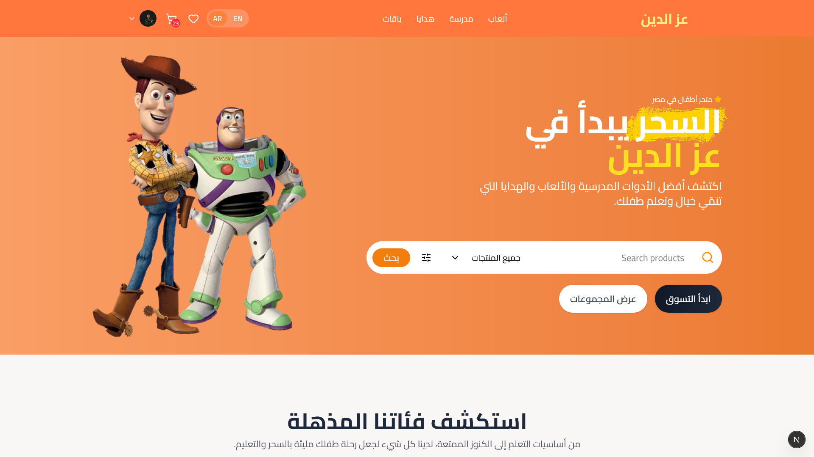
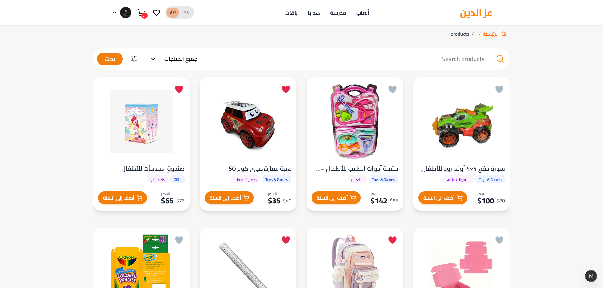
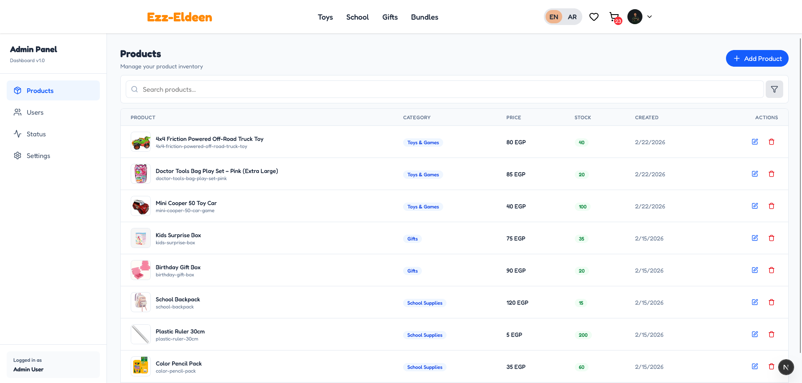

# Ezz-Eldeen

[](https://ezz-eldeen.vercel.app)
[](LICENSE)

## Overview

**Ezz-Eldeen** is a modern e-commerce book store that also sells gifts, school supplies, toys, and games.  
The platform is fully responsive, supports multiple languages (Arabic & English), and provides a seamless shopping experience for users of all ages.

---

## Features

- **Multi-language support** – Arabic & English  
- **Shopping cart & wishlist**  
- **Search, filters, categories, subcategories, and tags**  
- **Related products recommendation**  
- **Fully responsive design**  
- **Role-based dashboard for admin**  
- **Smooth animations with Framer Motion**  
- **Fast & modern frontend using Next.js + TypeScript**  

---

## Tech Stack

**Frontend:**  
Next.js, TypeScript, Tailwind CSS, Framer Motion, SplideJS, Next-intl, twMerge  

**Backend:**  
Node.js, Express.js, JWT authentication  

**Database:**  
MongoDB  

**Other Tools & Services:**  
Cloudinary (for image uploads), Vercel (deployment)  

---

## Live Demo

Check out the live project here: [https://ezz-eldeen.vercel.app](https://ezz-eldeen.vercel.app)

---

## Screenshots / Demo

Here are some screenshots of the project (placeholders, replace with actual images):

  
  
  

*(Add more screenshots as needed to showcase features and UI.)*

---

## Installation & Setup

### Frontend

1. Clone the repository:  
```bash
git clone <your-repo-url>
cd ezz-eldeen-frontend
```